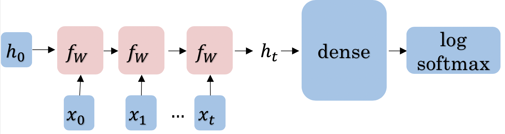

# Deep N-grams

## Overview

This project demonstrates text generation using Recurrent Neural Networks (RNNs), with the primary objective of predicting the next set of characters based on the preceding ones. This seemingly straightforward task holds immense practicality in applications like predictive text and creative writing.

The journey unfolds as follows:

- Data Preprocessing
- Dataset Creation
- Neural Network Training
- Character Embeddings: Represent each character as a vector, a fundamental technique in NLP.
- GRU Model: Gated Recurrent Unit (GRU) to process character embeddings and make sequential predictions.
- Prediction Process: The model's predictions are achieved through a linear layer and log-softmax computation.

### GRU Model


## Prerequisites

Before running the notebook, ensure you have the following installed:

- Python 3.11.7
- Jupyter Notebook or JupyterLab
- TensorFlow

The `requirements.txt` file should contain:

```txt
numpy
pandas
tensorflow
matplotlib
# Add any other dependencies
```

## Data Preprocessing Overview

Preparing the data for training the model involves several steps:

- **Dataset Import**: Import the dataset, where each sentence is structured as one line. Remove any extra spaces from these lines using the `strip` function.

- **Data Storage**: Store each cleaned line in a list, which will serve as the foundational dataset for your text generation task.

- **Character-Level Processing**: Process the text at the character level by converting each individual character into a numerical representation:
  - Use the [`tf.strings.unicode_split`](https://www.tensorflow.org/api_docs/python/tf/strings/unicode_split) function to split each sentence into its constituent characters.
  - Utilize [`tf.keras.layers.StringLookup`](https://www.tensorflow.org/api_docs/python/tf/keras/layers/StringLookup) to map these characters to integer values.

- **TensorFlow Dataset Creation**: Create a TensorFlow dataset capable of producing data in batches, with each batch consisting of `batch_size` sentences, each containing a maximum of `max_length` characters.

## Defining the GRU Language Model (GRULM)

- **Embedding Layer**: Initializes the embedding layer to convert input characters to vectors.
  - `tf.keras.layers.Embedding(vocab_size, embedding_dim)`
    - `vocab_size`: Number of unique characters in the vocabulary.
    - `embedding_dim`: Dimensionality of the embedding vectors.

- **GRU Layer**: Gated Recurrent Unit (GRU) layer for processing sequences.
  - `tf.keras.layers.GRU`
    - `units`: Number of recurrent units in the layer.
    - `return_sequences`: Whether to return the last output in the output sequence.
    - `return_state`: Whether to return the last state in addition to the output.

- **Dense Layer**: A dense (fully connected) layer for producing final output predictions.
  - `tf.keras.layers.Dense`
    - `units`: Number of units in the layer, set to `vocab_size`.
    - `activation`: Set to `tf.nn.log_softmax`.

- **Log-Softmax**: Computes the log of the softmax output probabilities.
  - `tf.nn.log_softmax`

## Usage

To run the notebook, use the following command in your terminal:

```bash
jupyter notebook main.ipynb
```

This will open the notebook in your default web browser. Follow the cells sequentially to execute the entire workflow.
