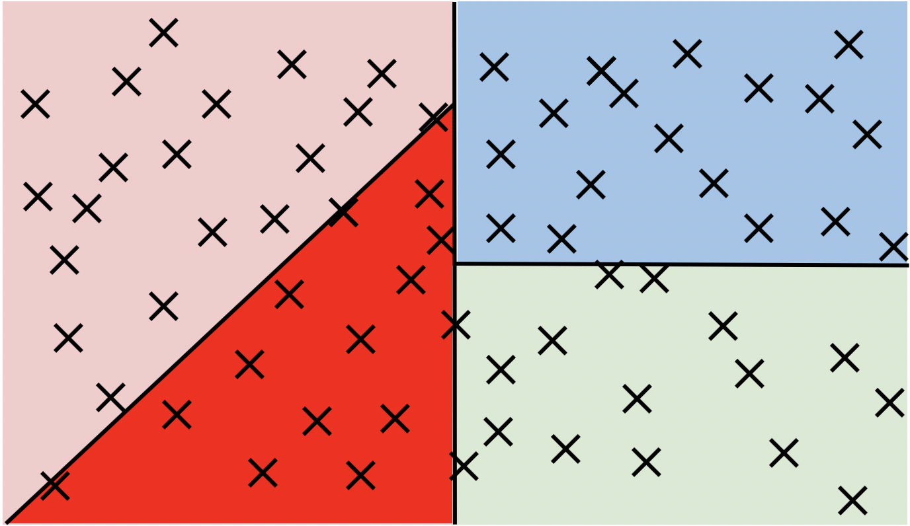
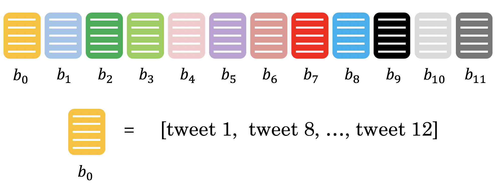

### Getting the Document Embeddings

#### Bag-of-words (BOW) Document Models
Text documents are sequences of words.
* The ordering of words makes a difference. For example, sentences "Apple pie is
better than pepperoni pizza." and "Pepperoni pizza is better than apple pie"
have opposite meanings due to the word ordering.
* However, for some applications, ignoring the order of words can allow
us to train an efficient and still effective model.
* This approach is called Bag-of-words document model.

#### Document Embeddings
* Document embedding is created by summing up the embeddings of all words
in the document.
* If we don't know the embedding of some word, we can ignore that word.

### Finding the most Similar Tweets with LSH

Implement locality sensitive hashing (LSH) to identify the most similar tweet.
* Instead of looking at all 10,000 vectors, you can just search a subset to find
its nearest neighbors.

Data points are plotted like this:

Divide the vector space into regions and search within one region for nearest neighbors of a given vector.

#### Choosing the number of planes

* Each plane divides the space to $2$ parts.
* So $n$ planes divide the space into $2^{n}$ hash buckets.
* We want to organize 10,000 document vectors into buckets so that every bucket has about $~16$ vectors.
* For that we need $\frac{10000}{16}=625$ buckets.
* We're interested in $n$, number of planes, so that $2^{n}= 625$. Now, we can calculate $n=\log_{2}625 = 9.29 \approx 10$.

### Understanding How to Get a Hash Number for a Vector

To assign each vector a unique number for a "hash bucket," we use a process that involves hyperplanes in vector spaces.

#### What are Hyperplanes in Vector Spaces?

- In a 3-dimensional space, a hyperplane is like a regular plane. In a 2-dimensional space, a hyperplane is a line.
- Generally, a hyperplane is a subspace that has one dimension less than the original vector space.
- A hyperplane is defined by its normal vector.
- The normal vector of a plane is a vector that is perpendicular to every vector lying on that plane.

#### How Hyperplanes Split Vector Spaces

Hyperplanes can divide a vector space into two parts:
- Vectors that have a positive dot product with the normal vector of the hyperplane are on one side.
- Vectors that have a negative dot product with the normal vector are on the other side.

#### Assigning Vectors to Hash Buckets

To assign a vector to a hash bucket, we use hyperplanes as follows:
- Compute the dot product of the vector with the normal vector of each hyperplane.
- If the dot product is positive, the vector is on the same side as the normal vector, and we encode this with a 1.
- If the dot product is negative, the vector is on the opposite side, and we encode this with a 0.
- By doing this for multiple hyperplanes and in the same order for each vector, we create a unique binary code (e.g., [0, 1, 1, 0]) that serves as the vector's hash ID.

### Hash_value_of_vector

Initialized hash table `hashes`. It is list of `N_UNIVERSES` matrices, each describes its own hash table. Each matrix has `N_DIMS` rows and `N_PLANES` columns. Every column of that matrix is a `N_DIMS`-dimensional normal vector for each of `N_PLANES` hyperplanes which are used for creating buckets of the particular hash table.

Function `hash_value_of_vector` places vector `v` in the correct hash bucket.

* First multiply vector `v`, with a corresponding plane. This will give a vector of dimension `N_planes`.
* Will then convert every element in that vector to 0 or 1.
* If the element is negative, it becomes a 0, otherwise you change it to a 1 and hash vector is created.
* Then compute the unique number for the vector by iterating over `N_PLANES`
* Then multiply $2^i$ times the corresponding bit (0 or 1).
* Will then store that sum in the variable `hash_value`.

**Create a hash for the vector by Formula**:

$$ hash = \sum_{i=0}^{N-1} \left( 2^{i} \times h_{i} \right) $$

### Make_hash_table

Given that you have a unique number for each vector (or tweet), You now want to create a hash table. You need a hash table, so that given a hash_id, you can quickly look up the corresponding vectors. This allows you to reduce your search by a significant amount of time.

  

### Approximate_knn

Implement approximate K nearest neighbors using locality sensitive hashing,
to search for documents that are similar to a given document at the
index `doc_id`.

##### Inputs
* `doc_id` is the index into the document list `all_tweets`.
* `v` is the document vector for the tweet in `all_tweets` at index `doc_id`.
* `planes_l` is the list of planes (the global variable created earlier).
* `k` is the number of nearest neighbors to search for.
* `num_universes_to_use`: to save time, we can use fewer than the total
number of available universes.  By default, it's set to `N_UNIVERSES`,
which is $25$ for this assignment.
* `hash_tables`: list with hash tables for each universe.
* `id_tables`: list with id tables for each universe.

The `approximate_knn` function finds a subset of candidate vectors that
are in the same "hash bucket" as the input vector 'v'.  Then it performs
the usual k-nearest neighbors search on this subset (instead of searching
through all 10,000 tweets).

